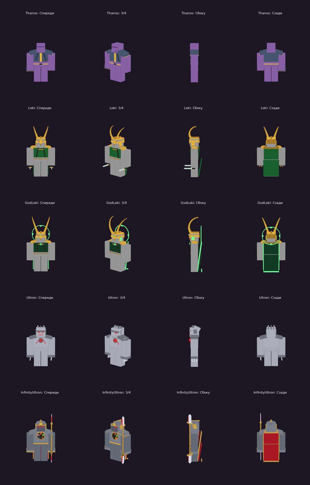

# Roblox-игра

Код игры хранится здесь в виде файлов, а [Rojo](https://rojo.space) синхронизирует его с Roblox Studio в реальном времени. Claude может писать код и пушить его сюда, а при подключении MCP ещё и напрямую управлять твоим Studio.

## Способ 1. Код отсюда в Studio через Rojo

1. Поставь [Rokit](https://github.com/rojo-rbx/rokit) (менеджер инструментов), затем в папке проекта выполни:
   ```sh
   rokit install
   ```
   Команда поставит `rojo`, `selene` и `stylua` нужных версий.
2. Поставь плагин Rojo в Studio: `rojo plugin install`.
3. Забери свежий код и запусти сервер синхронизации:
   ```sh
   git pull
   rojo serve
   ```
4. В Studio открой вкладку **Plugins → Rojo → Connect**. Весь код из `src/` появится в игре и будет обновляться при каждом изменении файлов.

Нет времени на установку? Открой вкладку **Actions** на GitHub, выбери последний зелёный запуск и скачай артефакт **Game**. Внутри готовый `Game.rbxl`, его можно открыть в Studio двойным кликом.

## Способ 2. Claude сам управляет Studio (MCP)

Этот способ работает только на твоём компьютере: облачная сессия не видит твой Studio.

1. Обнови Roblox Studio и установи [Claude Code](https://claude.com/claude-code) или Claude Desktop.
2. В Studio открой **Assistant → Manage MCP Servers**, включи **Studio as MCP server** и нажми **Quick connect** для Claude Code.
3. Перезапусти Claude Code, открой в нём эту папку и выполни `/mcp`. В списке должен появиться Roblox Studio.
4. Запусти `rojo serve` (способ 1) и подключи Rojo в Studio, чтобы код из `src/` тоже синхронизировался.

После этого Claude сможет выполнять Luau в открытом месте, вставлять модели, запускать плейтест и читать консоль. Правила работы для Claude описаны в `CLAUDE.md`.

## Игра: Перчатка Бесконечности

У каждого игрока на правой руке **Перчатка Бесконечности**. Она собрана из 50 деталей: четыре пальца по две фаланги с изгибом, большой палец, костяшки, броня на тыльной стороне и квадратная манжета на предплечье. Камни стоят на своих местах, как в фильме: Разум в центре, Душа на большом пальце, Реальность, Пространство, Сила и Время на пальцах от указательного к мизинцу. Геометрия лежит в `src/shared/GauntletModel.luau`. При ударах за пальцами тянется шлейф, камни способности вспыхивают при касте, а со всеми шестью камнями вокруг перчатки появляется разноцветная аура. В инвентаре (B) можно посмотреть живую 3D-модель своей перчатки. По карте разбросаны 6 **Камней Бесконечности**. Каждый найденный камень загорается в перчатке и открывает новую способность. Прогресс сохраняется.

| Камень | Где искать |
|---|---|
| 🟣 Сила | На вершине фиолетовой башни |
| 🔵 Пространство | Над синими парящими платформами |
| 🔴 Реальность | В центре кирпичного лабиринта |
| 🟠 Душа | На самой высокой башне в дальнем углу карты |
| 🟢 Время | Над зелёным паркуром |
| 🟡 Разум | На пьедестале в дальнем поле |

### Герои (меню H)

| Герой | Как открыть | Внешний вид |
|---|---|---|
| 🧤 **Танос**, безумный титан | сразу | фиолетовая кожа, складки на подбородке, броня «Войны бесконечности», Перчатка Бесконечности |
| 🐍 **Локи**, бог обмана | сразу | золотой шлем с рогами, туника с ремнями, плащ, два кинжала |
| 🌳 **Локи, бог времени**, хранитель Иггдрасиля | 25 убийств за Локи | рога длиннее, «часовой» нимб, тёмный плащ, зелёная аура |
| 🤖 **Альтрон** | сразу | металлический корпус, красные глаза, ядро в груди, когти |
| ♾️ **Альтрон бесконечности** | 25 убийств за Альтрона **или убить игрока-Таноса за Альтрона** | как в «Что, если…?»: титановая броня с золотом, шлем-маска, Камень Разума во лбу, пять камней в нагруднике, красный плащ с золотой каймой, двуглавое копьё |

Бог времени взят из финала 2 сезона сериала «Локи» («Славная цель»): Локи научился управлять сдвигами во времени и останавливать время, а из ветвей мультивселенной сплёл Иггдрасиль.



Плащи развеваются при беге и падении, камни и глаза на костюмах «дышат» светом. У роботов металлический корпус, одежда снимается. При телепортах и рывках остаётся светящийся послеобраз, энергетические лучи окружены молниями, каждое попадание высекает искры.

### Танос: способности по фильмам

| Клавиша | Способность | Нужно | Сцена из фильма |
|---|---|---|---|
| ЛКМ | Удар | — | серия из 3 ударов Перчаткой |
| F | Залп Перчатки | — | с Камнем Силы фиолетовый и мощнее |
| 1 | Удар Силы | Сила | удар о землю, волна и отбрасывание |
| 2 | Портал | Пространство | порталы Тессеракта |
| 3 | Распад реальности | Реальность | Дракс рассыпается на кубы (Забвение) |
| 4 | Похищение души | Душа | вытягивает здоровье у врагов рядом |
| 5 | Перемотка времени | Время | перемотка, как с Вижном в Ваканде: −4 секунды, позиция и здоровье |
| 6 | Луч Разума | Разум | жёлтый пробивающий луч Вижна |
| Z | Луна Титана | Сила + Пространство | дождь из осколков луны (Титан) |
| X | Каменная тюрьма | Пространство + Реальность | Халкбастер в скале (Ваканда) |
| C | Жатва душ | Душа + Разум | оглушает всех рядом и забирает здоровье |
| G | **ЩЕЛЧОК** | все 6 камней | половина врагов обращается в пыль |

### Локи

| Клавиша | Способность | Что делает |
|---|---|---|
| ЛКМ | Кинжалы | быстрые удары; удар в спину ×2 |
| F | Метательный кинжал | 18 урона, в спину 30 |
| 1 | Иллюзия | невидимость на 4 секунды и обманка на месте; удар из невидимости: «Сюрприз!» ×3 |
| 2 | Двойники | три двойника бросаются на врагов и взрываются |
| 3 | Скипетр | синий луч Камня Разума, контроль разума на 2 секунды («Мстители») |
| 4 | Телепорт | зелёная вспышка в точку прицела |
| G | Ларец Древних Зим | ледяной конус замораживает врагов («Тор») |

### Локи, бог времени

| Клавиша | Способность | Что делает |
|---|---|---|
| ЛКМ | Нить времени | хлыст на 12 метров, подтягивает врага |
| F | Ветвь | пробивающий сгусток времени |
| 1 | Сдвиг во времени | возврат на 3 секунды назад (позиция и здоровье) |
| 2 | Остановка времени | все враги в радиусе 35 застывают на 3.5 секунды |
| 3 | Ветви Иггдрасиля | ветви оплетают и поднимают врагов |
| 4 | Дверь TVA | оранжевая дверь TemPad, проход в точку прицела |
| G | **Славная цель** | Локи поднимается, вырастает Иггдрасиль, ветви хватают всех в радиусе 70 |

### Альтрон («Мстители: Эра Альтрона»)

| Клавиша | Способность | Что делает |
|---|---|---|
| ЛКМ | Вибраниевые когти | серия из 3 ударов, третий сильнее |
| F | Репульсор | красный луч из ладони |
| 1 | Часовые | 3 дрона 10 секунд стреляют по врагам |
| 2 | Реактивный рывок | антигравитационный рывок |
| 3 | Гравитационный пресс | подбрасывает врагов и впечатывает в землю |
| 4 | Перенос сознания | переселяется в тело часового и чинит себя |
| G | **Подъём Соковии** | пласт земли с врагами взлетает и рушится |

### Альтрон бесконечности («Что, если…?», эпизоды 8–9)

| Клавиша | Способность | Что делает |
|---|---|---|
| ЛКМ | Удар бесконечности | взмахи и выпады двуглавым копьём, каждый заряжен следующим камнем |
| F | Залп Камня Разума | пробивающий луч, которым он разрубил Таноса |
| 1 | Прыжок между мирами | порталы Камня Пространства |
| 2 | Сверхновая Силы | взрыв Камня Силы вокруг |
| 3 | Армия Альтронов | 5 усиленных часовых |
| 4 | Петля времени | возврат на 4 секунды назад |
| 5 | Жатва Камня Души | забирает здоровье у всех рядом |
| G | **Конец мультивселенной** | шесть волн цветов камней и финальный белый взрыв |

Общие клавиши: **B** — инвентарь, **V** — магазин, **H** — герои.

На телефоне способности нажимаются кнопками на панели, а прицел берётся по центру экрана.

Бить можно и других игроков (PvP), и манекенов вокруг арены.

### Монеты и магазин

| Как заработать | Сколько |
|---|---|
| Убить манекена | 10 🪙 |
| Убить игрока | 25 🪙 |
| Впервые подобрать камень | 50 🪙 |
| Каждую минуту в игре | 5 🪙 |

В магазине (V) есть два раздела:
- **Прокачка** (по 5 уровней): ⚔️ Мощь (+12% урона), ⏱️ Скорость (−8% перезарядки), ❤️ Живучесть (+20 к здоровью).
- **Скины Перчатки**: Классика, Серебро Асгарда, Нано-перчатка, Обсидиан, Космическая (силовое поле) и Радужная (переливается цветами). Цвет скина окрашивает удары и луч.

### Эффекты и атмосфера

- **Карта Титана:** рельеф с лавовыми трещинами, кольцо гор и скальных шпилей, облака и закатное освещение с bloom и дымкой. Центральная арена с шестью колоннами, над которыми парят кристаллы камней. Есть руины, парящие скалы, светящиеся кристаллы и светящиеся дорожки от арены к каждому камню.
- **Маркеры камней** на экране показывают расстояние, их видно через стены.
- **Бой:** цифры урона, хитмаркер, счётчик комбо, дуги ударов, частицы, вспышки света, тряска камеры и толчок FOV. Красная вспышка при получении урона, мир теряет цвет при низком здоровье. Лента убийств показывает, кто кого и чем победил.
- **Щелчок:** чёрные кинополосы, приближение камеры, камни вспыхивают по кругу, затем белая вспышка, и мир становится чёрно-белым. Стёртые игроки видят сообщение «Ты стёрт щелчком…».
- **Получение камня:** столб света, баннер на весь экран и вспышка цвета камня.
- **Анимации руки** сделаны кодом, без ассетов: замах при ударе, рука вперёд при касте, рука вверх при щелчке. Их видят все игроки.
- **Звуки** настраиваются в `src/shared/Sounds.luau`: вставь свои `rbxassetid://…`.

## Структура

```
src/
  shared/   → ReplicatedStorage.Shared      Items, Abilities, Shop (прокачка/скины), Sounds, Config, Remotes
  server/   → ServerScriptService.Server
    Combat/Heroes/  Thanos, Loki, GodLoki (способности героев)
    Services/  DataService, CombatService, ShopService, StoneService, MapService,
               GauntletService, DummyService, LeaderstatsService
    Combat/    AbilityHandlers (логика способностей), Damage, Status (оглушение/замедление), Fx (эффекты)
  client/   → StarterPlayerScripts.Client
    Controllers/  AbilityController (панель + клавиши), InventoryController, ShopController,
                  HudController, NotifyController, DamageFxController (цифры урона, комбо, лента убийств),
                  ScreenFxController (щелчок, баннеры, FOV), PoseController (анимации руки),
                  StoneVisualsController (камни + маркеры), WorldFxController (частицы, декор)
tools/verify.luau      проверка собранного place-файла (Lune)
default.project.json   карта дерева для Rojo
```

Сервер никогда не доверяет клиенту. Он сам проверяет, собраны ли нужные камни, прошла ли перезарядка, нет ли у игрока оглушения и не превышена ли дальность прицела. Данные игрока сохраняются в DataStore: при сбое загрузка повторяется, есть автосейв, сохранение при выходе игрока и при выключении сервера.

> Чтобы сохранения работали в Studio, включи **Game Settings → Security → Enable Studio Access to API Services** (место должно быть опубликовано).
